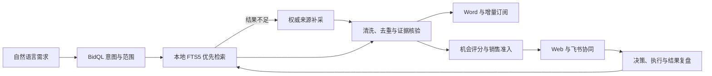
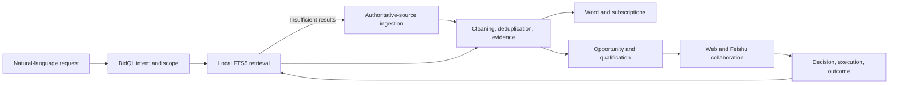

# TenderTrace

<p align="center">
  <strong>招投标情报、机会经营与飞书协作的一体化 AI 工作台</strong><br>
  Tender intelligence, opportunity operations, and Feishu collaboration in one local-first system
</p>

<p align="center">
  <a href="#中文说明">中文</a> · <a href="#english-readme">English</a>
</p>

<p align="center">
  <sub>Current stage: P53 · 16 sources · multi-agent review, executable Feishu war room & fact-gated LLM summary · 424 automated tests pass</sub>
</p>

---

<details open>
<summary id="中文说明"><strong>中文说明</strong></summary>

## 产品定位

TenderTrace 不只是一次性的招标搜索工具。它把分散公告转化为可追踪、可核验、可协作的销售机会：系统持续采集公开信息，优先从本地知识库检索，生成带证据的 Word 报告，再把高价值线索推进到负责人、团队、客户关系、Go/Hold/No-Go 和投标复盘流程。

用户可以在 Web 或飞书中直接输入自然语言问题，例如“最近三个月上海充电桩招标信息，每天 9:00 推送”。TenderTrace 会解析主题、行政区划、时间和频率；即时问题直接运行，带计划的问题创建增量订阅。定时报告通过 `sent_history` 只包含未发送过的公告，可在 Web 下载、在本地 outbox 追踪，也可按配置投递到邮件或飞书。

## 核心闭环



系统采用“先采集入库，后本地检索”的架构。后台采集订阅持续扩充 `notices`，用户查询优先使用 SQLite FTS5、jieba 分词和 BM25 排序；本地结果不足时才触发现场补采。这样，历史公告会被持续复用，查询响应和召回能力不再受单次抓取页数直接限制。

## 能力矩阵

| 能力域 | 已实现的产品能力 |
|---|---|
| 意图与检索 | 解析主题、品类同义词、省市区、相对或绝对时间、执行频率；完整行政区划与范围路由避免静默降级。检索支持 FTS5 + BM25，本地结果不足时自动补采；安装可选依赖后可使用 BGE 向量召回并通过 RRF 与关键词结果融合。 |
| 采集与证据 | 统一适配公开 API、静态页面、动态页面和登录态来源；支持限流、`Retry-After`、指数退避、阻断识别、详情批量抓取和页面快照。正文经过模板清理、URL 规范化、项目编号提取与 SimHash 去重，PDF、DOCX、XLSX 附件可受限下载并抽取证据片段。 |
| 报告与订阅 | Word 报告包含标题、发布时间、来源链接、核心内容、附件链接和来源健康信息。APScheduler 分离“后台采集订阅”和“用户报告订阅”，后者依靠 `sent_history` 保证增量不重复，并记录新增数、跳过历史数、下次执行和交付结果；飞书项目群会同时接收 Word 附件和由同次真实运行统计生成的检索简报卡，附件成功与简报失败分开审计，避免误报交付状态。 |
| 机会经营 | 根据时效、完整度、可信度、多源佐证和需求覆盖计算机会等级；维护唯一负责人、阶段化团队、合作伙伴和客户关键人。采购主体、预算、项目编号、截止时间等字段可附证据人工核验，核验后重算销售准入。 |
| 决策与执行 | 统一动作契约控制认领、事实复核、Go/Hold/No-Go、投标准备、结果和归档。团队覆盖、客户关系、证据完整度、机会评分和投标窗口共同构成可解释门禁；重大公告变更会使旧决策失效并进入复核与 SLA 升级。会审队列、Agent 建议和人工裁决均保留原文证据，不覆盖要求账本。 |
| 市场与复盘 | 从本地公告形成品类预算基准、采购主体集中度、采购阶段分布和成交供应商画像。赢标或失标结果记录原因、经验、后续行动与证据，并回流胜率、败因、竞品和成交价格基准。样本不足时明确降级，不生成伪精确结论。 |
| 个人与组织记忆 | 个人记忆记录查询、点击、下载、订阅和运行，形成周报、偏好与可执行建议。组织记忆按飞书项目群隔离，群成员可显式记录和查询共享事实，并将其审计式转换为机会事实或客户行动；两类记忆分表存储，不互相污染。 |
| 模型与评测 | 支持纯规则、本地 Ollama 和 OpenAI 兼容云端增强，运行时可切换。评测覆盖意图 Harness、RAG 证据、Agent checkpoint/trace、来源可靠性、Recall Proxy 和人工金标 Recall@K；代理指标不冒充严格召回率。 |

## 信息来源

TenderTrace 当前覆盖 16 个来源。范围路由根据查询地区选择对应来源，国内城市查询不会无意义地访问国际平台，国际或全球查询也会启用相匹配的官方数据源。

| 范围 | 来源 | 采集重点 |
|---|---|---|
| 国内公开 | 中国政府采购网、全国公共资源交易平台 | 公告列表、详情、地区、发布时间、项目编号与附件 |
| 国内权威 | 中国人民银行集中采购中心、中共中央直属机关采购中心 | 采购主体、预算、品类、开标时间、采购与结果公告；图片型公告会明确标记内容边界 |
| 国内登录态 | 千里马 | 使用 Playwright `storage_state` 保存登录态，只读取免费会员可见内容，代码不保存账号密码 |
| 欧盟与英国 | TED、Contracts Finder、Find a Tender | 官方 API、OCDS 数据、采购与结果信息 |
| 国际组织 | UNGM、世界银行、亚洲开发银行、非洲开发银行、EBRD ECEPP、美洲开发银行 | 国际机构采购公告；UNGM 同时覆盖多个联合国组织 |
| 国家开放数据 | CanadaBuys、Prozorro | 加拿大联邦开放招标数据；乌克兰官方游标 feed、详情、金额、币种与附件证据 |

来源健康不是静态标签。系统会按真实运行记录请求成功率、反爬阻断、延迟、最近成功时间和登录状态评估来源可用性；命中率单独作为查询覆盖观测，不把“本次无匹配公告”误判为来源故障。页面型反爬即使返回 HTTP 200 也会标明“阻断响应”，不会伪装为成功。没有运行样本的来源显示为“未观察”，来源异常可生成飞书告警和带 SLA 的 Task v2 处置任务。

## 飞书深度协作

飞书在 TenderTrace 中既是消息渠道，也是协作执行面。连接中心可读取机器人所在群和授权通讯录成员，设置统一接收目标；Web 可创建项目群、邀请成员，群内问题可以触发即时 Word 或绑定原会话的增量订阅。

| 协作场景 | 系统行为 |
|---|---|
| 群聊入口 | 自然语言即时查询生成 Word；包含频率的请求创建当前会话专属订阅。消息事件持久化去重，失败后可恢复。 |
| 机会卡片 | 认领、阶段推进、Go/Hold/No-Go 和建议反馈使用服务端统一动作契约；卡片回调写回 SQLite、Web 状态和审计事件。 |
| 任务与日程 | 负责人作为 Task v2 `assignee`，团队与伙伴作为 `follower`；截止日可同步日历。任务创建、更新和提醒使用稳定幂等键，避免重复。 |
| 战情室与会审 | 机会详情先给出卡片、负责人任务、截止日历、多维表格、五角色会审与要求任务的启动前检查；已选项目群会成为预检和启动的同一接收目标，确认后会先按要求账本和公告变更生成会审 case，再执行飞书资源创建并将逐步结果写入机会审计事件。AI 会审只形成带分歧标记的证据建议，人工裁决仍是唯一可改变会审状态的动作；会审摘要卡可按当前账本状态同步到项目群并去重，群成员可发送 `项目意见 <机会编号>：<内容>` 回写同一机会账本。 |
| 多维表格 | 公告和机会可同步为协同台账；伙伴提交的外部线索先预检公网来源和内容指纹，再进入本地库与 FTS，并回写核验状态。 |
| 组织记忆 | 每个项目群拥有独立共享记忆。明确的记录/查询指令用于沉淀会议事实、客户信号和决策依据，普通招标问题仍走报告或订阅。 |
| 经营管理 | 周报、机会晨报、重大变更、决策逾期和来源 SLO 可发送为可操作卡片；成功投递按接收人和业务指纹去重。 |

飞书身份边界保持严格：首次认领通过交互卡获取成员真实 `open_id`，不会把多维表格用户标识当成任务负责人。手机号、邮箱、App Secret、会话 ID 和任务 ID 不出现在公开日志或安全状态接口中。

## Web 工作台

| 页面 | 主要用途 |
|---|---|
| 工作台 | 输入查询、预览意图、选择立即运行或创建订阅，查看 TenderGraph 的实时阶段、来源进度和 Word 输出。 |
| 历史运行 | 搜索、筛选和排序运行记录，检查 trace、checkpoint、结果数和失败原因。 |
| 订阅管理 | 分别管理报告订阅与后台采集计划，查看下次执行、新增/跳过数量和最近交付。 |
| 机会情报 | 按行动优先级、等级、截止时间和阶段研判机会，维护负责人、团队、关键人、核验事实、关系行动和投标决策；档案顶部的实时推进路径按公告变更、要求覆盖、会审队列和协同门禁标出下一步，并可直达对应工作区；可在档案内启动飞书战情室、查看执行回执并沉淀跨角色协作意见。 |
| 数据源 | 查看范围路由、登录态、真实采集指标、可靠性、SLO 告警和处置状态。 |
| 用户记忆 | 查看使用周报、知识偏好、风险信号和可执行建议，采纳后创建真实采集或报告订阅。 |
| Agent 评测 | 对比意图 Harness、RAG、Agent、来源质量和人工金标 Recall@K，明确区分代理指标与正式验收。 |
| 设置 | 管理模型策略、搜索深度、飞书连接、多维表格、任务、日程、事件回调和安全配置状态。 |

## 技术架构

| 层次 | 主要实现 |
|---|---|
| Web 与 API | FastAPI、Uvicorn、静态 HTML/CSS/JavaScript、OpenAPI |
| 状态编排 | TenderGraph、事件流、checkpoint、运行 trace |
| 数据与检索 | SQLite、WAL、FTS5、jieba、BM25、可选 sentence-transformers/RRF |
| 采集 | httpx、Playwright、selectolax、trafilatura、来源适配器 |
| 清洗与文档 | SimHash、pypdf、openpyxl、python-docx |
| 调度与交付 | APScheduler、Web/outbox、SMTP、飞书消息与多维表格 |
| 模型 | 规则引擎、Ollama、本地模型、OpenAI-compatible API |
| 工程质量 | pytest、Ruff、配置脱敏、幂等账本、审计事件 |

核心目录如下：

```text
tendertrace/
  adapters/              多源采集适配器
  app/                   FastAPI 应用与 Web API
  intent/                BidQL 意图解析
  integrations/          飞书及外部系统集成
  llm/                   本地/云端模型网关
  pipeline/              清洗、去重、附件与证据链
  report/                Word 报告生成
  runtime/               TenderGraph、事件与 checkpoint
  scheduling/            采集订阅、报告订阅与 sent_history
  vault/                 千里马 storage_state 管理
  db.py                  SQLite schema 与迁移
  memory.py              个人记忆、周报与建议
  opportunity.py         机会评分、市场研判与行动建议
  retrieval.py           FTS5、LIKE 与向量融合检索
  workflow.py            销售阶段、门禁、决策与审计
web/dist/                Web 工作台
integrations/feishu-record-view/  飞书多维表格记录视图扩展
tests/                   自动化测试
```

## 快速开始

运行环境要求 Python 3.11 或更高版本。基础安装不要求 Ollama、OpenAI 或飞书；这些能力按需开启。

```powershell
python -m venv .venv
.\.venv\Scripts\python -m pip install -e .[dev]
copy .env.example .env.local
.\.venv\Scripts\python -m tendertrace init-db
.\.venv\Scripts\python -m tendertrace config-check
.\.venv\Scripts\python -m tendertrace serve
```

打开 [http://127.0.0.1:8000/](http://127.0.0.1:8000/)。开发阶段需要自动加载 Python 修改时，可使用 `python -m tendertrace serve --reload`；端口被占用时在 `.env.local` 修改 `TENDERTRACE_PORT`。

### 模型模式

| `TENDERTRACE_MODEL_MODE` | 行为 | 依赖 |
|---|---|---|
| `disabled` | 仅使用规则、词典和本地检索，不调用模型 | 无 |
| `local` | 通过 Ollama 增强主题理解与内容处理 | 本地 Ollama，推荐从 `qwen3:8b` 起步 |
| `cloud` | 使用 OpenAI-compatible API 增强 | `OPENAI_API_KEY` 与可用模型 |

模型增强由 `TENDERTRACE_MODEL_ENHANCEMENT_ENABLED` 控制。配置后先执行：

```powershell
python -m tendertrace model-status
python -m tendertrace model-doctor
```

### 常用工作流

| 目标 | 命令 |
|---|---|
| 解析自然语言 | `python -m tendertrace parse-intent "最近一个月上海充电桩招标信息"` |
| 运行并生成 Word | `python -m tendertrace run-once "最近一个月上海充电桩招标信息" --max-pages 2 --max-results 8` |
| 仅采集入库 | `python -m tendertrace ingest-once --topic 充电桩 --region 上海 --window-days 30 --max-pages 1 --max-results 20` |
| 创建后台采集计划 | `python -m tendertrace create-ingest-subscription --name 上海充电桩采集 --topic 充电桩 --region 上海 --cron "0 */6 * * *"` |
| 创建增量报告订阅 | `python -m tendertrace create-subscription "最近一个月上海充电桩招标信息，每天9:00发送给我"` |
| 检查数据源 | `python -m tendertrace source-status` |
| 生成用户周报 | `python -m tendertrace memory-weekly --days 7 --save` |
| 运行发布前检查 | `python -m tendertrace preflight --no-package` |

### 千里马登录态

登录过程由用户在 Playwright 浏览器中完成，保存文件只包含浏览器 `storage_state`，不会把账号密码写入代码：

```powershell
python -m tendertrace login-qianlima
python -m tendertrace verify-qianlima --live
```

### 飞书连接

在 `.env.local` 中配置飞书自建应用并开启 `FEISHU_ENABLED=true`。消息、组织协作和多维表格可以复用同一应用，也可以分别配置。真实凭据只保存在本地环境文件中。

```powershell
python -m tendertrace feishu-status
python -m tendertrace feishu-list-chats --page-size 20
python -m tendertrace feishu-send-text --text "TenderTrace 连接测试"
python -m tendertrace feishu-bitable-check --ensure-fields
python -m tendertrace feishu-import-leads --dry-run
```

需要从飞书接收自然语言命令时，运行 `python -m tendertrace feishu-bot-listen`，并在飞书开放平台发布包含机器人、通讯录、消息、Task v2、多维表格等所需权限的应用版本。完整 API 可在服务启动后查看 `/docs`，README 只保留稳定的能力边界，不重复维护全部路由清单。

## 配置原则

`.env.local` 是唯一推荐的本地密钥入口，已被 Git 忽略。完整变量及默认值见 [.env.example](.env.example)，主要配置组如下：

| 配置组 | 关键前缀 | 用途 |
|---|---|---|
| 服务与存储 | `TENDERTRACE_HOST`、`TENDERTRACE_PORT`、`TENDERTRACE_*_DIR` | Web 地址、SQLite、outbox、快照和 trace 路径 |
| 模型 | `TENDERTRACE_MODEL_*`、`OPENAI_*` | 规则、本地 Ollama 与云端模式 |
| 投递 | `TENDERTRACE_DELIVERY_CHANNELS`、`TENDERTRACE_SMTP_*` | Web、outbox、邮件和飞书交付 |
| 飞书 | `FEISHU_*`、`TENDERTRACE_FEISHU_*` | 消息、群聊、任务、日程、多维表格和事件回调 |
| 销售门禁 | `TENDERTRACE_QUALIFICATION_*`、`TENDERTRACE_DECISION_*` | 机会阈值、团队与关系覆盖、决策 SLA |
| 自动化 | `TENDERTRACE_*_CRON` | 采集、订阅、晨报、告警和任务同步频率 |

## 评测与验证

意图 Harness 用固定样例校验主题、地区、时间与频率槽位；RAG 评测关注证据通过、附件抽取和报告产出；Agent 评测检查 TenderGraph checkpoint、trace 和失败恢复。严格召回率来自人工核验的金标集，候选生成不会自动回填金标答案。

```powershell
python -m tendertrace gold-candidates --max-pages 2 --max-results 30 --out docs/evaluation/gold_candidates_latest.json
python -m tendertrace gold-coverage --out docs/evaluation/gold_coverage_latest.json
python -m tendertrace evaluate-gold --out docs/evaluation/recall_latest.json
python -m pytest -q
python -m ruff check .
node --check web\dist\app.js
python -m tendertrace acceptance-check --no-runtime
```

## 安全边界

`.env.local`、`.env`、`secrets/`、`data/`、`outputs/`、`outbox/`、`snapshots/`、`traces/`、Playwright `storage_state`、真实 API Key、Cookie 和本地数据库均不得提交到公开仓库。`config-check`、模型状态和飞书状态只输出脱敏摘要；合作伙伴线索导入拒绝本机、私网、云元数据和带凭据 URL，并限制响应大小与重定向目标。

</details>

---

<details>
<summary id="english-readme"><strong>English README</strong></summary>

## Product Positioning

TenderTrace is more than a one-off tender search tool. It converts fragmented procurement notices into traceable, evidence-backed sales opportunities. The system continuously ingests public data, searches the local knowledge base first, generates auditable Word reports, and moves qualified leads through ownership, team coverage, stakeholder strategy, Go/Hold/No-Go decisions, and bid-outcome review.

A user can ask a natural-language question in the Web UI or Feishu, such as “Send me Shanghai EV-charging tenders from the last three months every day at 09:00.” TenderTrace resolves topic, administrative region, time window, and schedule. Immediate requests run once; scheduled requests create incremental subscriptions whose later reports contain only notices not already recorded in `sent_history`.

## Operating Loop



The architecture is local-first. Background ingestion grows the SQLite notice library; user queries run through jieba-tokenized FTS5 and BM25 before live collection is considered. Historical evidence remains reusable, and recall is no longer capped directly by the number of pages fetched for one query.

## Capability Matrix

| Domain | Implemented capability |
|---|---|
| Intent and retrieval | Parses topic, category synonyms, province/city/district, relative or absolute time, and frequency. Scope routing avoids silent regional fallback. Optional BGE embeddings are fused with FTS results through RRF. |
| Collection and evidence | Handles official APIs, static pages, dynamic pages, and authenticated sources with throttling, retry, block detection, detail retrieval, and snapshots. Content is cleaned, canonicalized, deduplicated, and enriched with bounded PDF, DOCX, and XLSX extraction. |
| Reports and schedules | Word reports include title, publish time, source URL, core facts, attachment links, and source health. APScheduler separates ingestion plans from user delivery subscriptions; `sent_history` makes scheduled output incremental and auditable. A Feishu project group receives both the Word attachment and a digest card built from the same run's real evidence and coverage; file and digest outcomes are audited independently. |
| Opportunity operations | Scores freshness, completeness, credibility, corroboration, and requirement coverage. Maintains one accountable owner, a stage-aware pursuit team, partners, stakeholders, evidence-backed fact overrides, and qualification gates. The dossier's live execution journey derives the next action from notice changes, requirement coverage, review cases, and collaboration gates, then links directly to that work area. |
| Decision and execution | A shared action contract governs claiming, review, Go/Hold/No-Go, bid preparation, outcome, and archive actions. Material notice changes invalidate stale decisions and enter an SLA-bound review workflow. |
| Market and outcomes | Builds category budget benchmarks, buyer concentration, procurement-stage distributions, award suppliers, competitors, win rates, and loss reasons from local evidence. Insufficient samples are labeled instead of extrapolated. |
| Personal and organization memory | Personal activity produces weekly profiles and executable advice. Feishu project groups have isolated organization memory that can be converted, with audit provenance, into opportunity facts or relationship actions. |
| Models and evaluation | Supports rule-only, local Ollama, and OpenAI-compatible cloud modes. Evaluation covers intent harnesses, RAG evidence, Agent traces/checkpoints, source reliability, recall proxy, and manually annotated Recall@K. |

## Source Coverage

TenderTrace currently routes across 16 sources without sending domestic city queries to irrelevant international platforms.

| Scope | Sources |
|---|---|
| China public procurement | China Government Procurement, National Public Resource Trading Platform |
| China authoritative procurement | PBC Procurement Center, Procurement Center for Organizations Directly under the CPC Central Committee |
| Authenticated China source | Qianlima free-member content through Playwright `storage_state` |
| EU and UK | TED, Contracts Finder, Find a Tender |
| International institutions | UNGM, World Bank, ADB, AfDB, EBRD ECEPP, IDB |
| National open data | CanadaBuys, Prozorro |

Source trust combines authority, observed request reliability, last successful run, primary-document evidence, independent corroboration, and attachment snapshots. After an authenticated session is actually rejected, the source leaves the collection queue to prevent repeated failures; a newly saved session or a later successful run makes it eligible again. Sources with no observations stay explicitly unobserved. SLO incidents can produce deduplicated Feishu alerts and owner-assigned Task v2 work with a configurable response deadline.

## Feishu Collaboration

Feishu is an execution surface rather than a notification-only integration. TenderTrace can discover bot-visible chats and authorized directory users, create project groups, invite members, execute natural-language queries in a conversation, and bind incremental subscriptions to the originating chat.

| Scenario | Behavior |
|---|---|
| Conversation entry | Immediate questions return Word to the current chat; scheduled questions create chat-bound incremental subscriptions with durable event deduplication. |
| Interactive opportunity cards | Claim, stage, decision, and advice actions consume the same server-side action contract as the Web UI and persist to SQLite and the audit stream. |
| Tasks and calendar | Owners are Task v2 assignees; internal and partner team members are followers. Stable idempotency keys prevent duplicate tasks, events, and reminders. |
| War room and review | The opportunity dossier preflights cards, ownership tasks, deadline calendar, Bitable, five-role review, and requirement tasks against the selected project group. Launch first derives review cases from the evidence ledger and material notice changes, then writes every result to the opportunity audit. AI review produces evidence-based, disagreement-aware suggestions only; an explicit human decision remains the sole state-changing action. The current evidence-ledger state can be sent as a deduplicated review digest card to that group. Group members can send `项目意见 <opportunity ID>：<content>` to append a collaboration note to the same opportunity ledger; the confirmation includes a deep link that opens that exact dossier. |
| Bitable | Notices and opportunities form a shared ledger. Partner-submitted leads are validated against a public source and content fingerprint before entering SQLite and FTS. |
| Organization memory | Each project chat owns a separate shared memory scope. Explicit record/search commands preserve meeting facts, customer signals, and decisions without mixing them into personal profiles. |
| Operations management | Weekly summaries, opportunity briefings, material changes, decision breaches, and source incidents are delivered as actionable, receiver-deduplicated cards. |

Identity boundaries are explicit: first-time claiming obtains the member's real `open_id` from an interactive card; a Bitable user identifier is never treated as a Task assignee. Phone numbers, email addresses, app secrets, chat IDs, and task IDs are excluded from public status output.

## Web Workbench

| View | Purpose |
|---|---|
| Workbench | Run a natural-language query or create a subscription while following TenderGraph progress and report output. |
| Run history | Search, filter, and sort runs; inspect traces, checkpoints, result counts, and failures. |
| Subscriptions | Manage user reports and background ingestion separately, including next run and incremental-delivery results. |
| Opportunities | Operate ownership, teams, stakeholders, facts, relationship actions, qualification, decisions, and outcomes; use the live execution journey to identify and open the next evidence, requirement, review, or collaboration task. |
| Sources | Inspect routing, authentication state, collection telemetry, reliability, SLO alerts, and incidents. |
| User memory | Review weekly activity, knowledge preferences, risks, and advice that creates real automation when accepted. |
| Agent evaluation | Compare intent, RAG, Agent, source, proxy-recall, and manually annotated Recall@K results. |
| Settings | Configure models, retrieval, Feishu, Bitable, Task v2, calendar, callbacks, and redacted health state. |

## Architecture

| Layer | Implementation |
|---|---|
| Web and API | FastAPI, Uvicorn, static HTML/CSS/JavaScript, OpenAPI |
| Orchestration | TenderGraph, event stream, checkpoints, run traces |
| Data and retrieval | SQLite, WAL, FTS5, jieba, BM25, optional sentence-transformers/RRF |
| Collection | httpx, Playwright, selectolax, trafilatura, source adapters |
| Documents | SimHash, pypdf, openpyxl, python-docx |
| Scheduling and delivery | APScheduler, Web/outbox, SMTP, Feishu messaging and Bitable |
| Models | Rule engine, Ollama, OpenAI-compatible API |
| Quality | pytest, Ruff, redacted configuration, idempotency ledgers, audit events |

## Quick Start

Python 3.11 or newer is required. Ollama, OpenAI, and Feishu are optional.

```powershell
python -m venv .venv
.\.venv\Scripts\python -m pip install -e .[dev]
copy .env.example .env.local
.\.venv\Scripts\python -m tendertrace init-db
.\.venv\Scripts\python -m tendertrace config-check
.\.venv\Scripts\python -m tendertrace serve
```

Open [http://127.0.0.1:8000/](http://127.0.0.1:8000/). During development, `python -m tendertrace serve --reload` reloads Python changes automatically.

| Goal | Command |
|---|---|
| Parse a request | `python -m tendertrace parse-intent "Shanghai EV-charging tenders from the last month"` |
| Generate a Word report | `python -m tendertrace run-once "最近一个月上海充电桩招标信息" --max-pages 2 --max-results 8` |
| Ingest without a report | `python -m tendertrace ingest-once --topic 充电桩 --region 上海 --window-days 30 --max-pages 1 --max-results 20` |
| Check sources | `python -m tendertrace source-status` |
| Check models | `python -m tendertrace model-doctor` |
| Check Feishu | `python -m tendertrace feishu-status` |
| Run preflight | `python -m tendertrace preflight --no-package` |

The full configuration contract is documented in [.env.example](.env.example). Keep all real credentials in `.env.local`; never commit them. Runtime API documentation is available at `/docs` after the service starts.

## Verification and Security

```powershell
python -m pytest -q
python -m ruff check .
node --check web\dist\app.js
python -m tendertrace acceptance-check --no-runtime
python -m tendertrace preflight --no-package
```

Do not publish `.env.local`, `.env`, `secrets/`, `data/`, `outputs/`, `outbox/`, `snapshots/`, `traces/`, Playwright `storage_state`, API keys, cookies, or local databases. Partner-lead ingestion rejects localhost, private networks, cloud metadata addresses, credential-bearing URLs, and unsafe redirects, and applies response-size limits.

</details>
