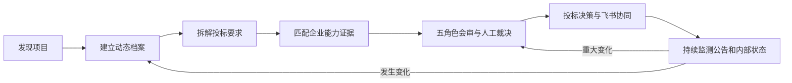

# TenderTrace 提升方向一 投标数字孪生优化进度与验收报告

**报告日期：** 2026 年 9 月 27 日  
**范围：** 投标数字孪生与动态项目档案  
**验收对象：** TenderTrace 本地项目 `E:\tt`  
**当前结论：** 核心开发、接口接入、实时刷新、历史快照和自动化回归测试已经完成。本地服务正在 `http://127.0.0.1:8000/` 运行。内置浏览器控制组件因运行环境缺少内核资源未能完成自动截图验收，因此本报告将视觉自动验收单独标为待复核，不把它写成已通过。

## 一 项目目标与完成情况

本次优化把原先分散在公告详情、附件、要求账本、企业能力、会审、团队、客户关键人、关系行动和飞书协同中的信息，汇总为一个持续更新的动态项目档案。用户打开任意机会详情后，首先看到项目驾驶舱，再向下进入各业务账本处理具体工作。

| 目标 | 完成结果 | 验收状态 |
|---|---|---|
| 一个档案汇总项目全量业务状态 | 新增数字孪生聚合服务，汇总公告、版本、附件、证据、要求、能力、会审、团队、关系行动和协作意见 | 通过 |
| 连续变化和实时更新 | 打开即读取最新数据库状态；档案页每 30 秒轮询；状态指纹改变时刷新完整详情 | 通过 |
| 保存历史版本 | 新增数字孪生快照表，相同状态不重复保存，真实变化才生成新快照 | 通过 |
| 三项独立评分 | 新增机会价值、企业匹配度、投标准备度，分别返回分数、状态、权重、证据和规则版本 | 通过 |
| 显著展示 | 机会详情顶部新增驾驶舱、三分卡片、六步流程、变化对比、行动建议和时间线 | 代码与静态资源通过，浏览器截图待复核 |
| 完整操作闭环 | 流程步骤可点击定位到公告变更、要求账本、能力矩阵、会审和飞书协同区域 | 通过 |
| 不伪造结果 | 数据不足时显示“数据待补”；企业匹配度只承认有来源且经人工确认的能力证据 | 通过 |

## 二 优化后的业务流程

实际页面将这条流程压缩成六个可点击步骤：发现项目、建立档案、拆解要求、匹配能力、会审决策、协同执行。每一步显示当前数量或状态，黄色步骤表示仍需处理。点击步骤后会滚动到对应工作区，避免用户在长页面中寻找入口。

## 三 动态项目档案包含的内容

数字档案直接读取项目已有业务表，不复制一套孤立数据。当前聚合范围如下：

1. 公告基本事实：标题、采购主体、项目编号、预算、地区、发布时间、投标截止时间、来源站点和原文链接。
2. 公告和附件变化：公告修订、变化字段、旧值、新值、变更复核状态、附件快照和证据项。
3. 投标要求：逐条要求、原文证据、来源链接、定位、强制性、置信度、责任人和处理状态。
4. 企业能力：已核验能力、要求与能力匹配、人工确认、缺口和待补证据。
5. 会审与行动：会审项、待裁决数量、会审行动和完成状态。
6. 协同执行：工作流阶段、负责人、核心团队、客户关键人、关系行动、协作意见和飞书同步状态。
7. 历史状态：每个不同的项目状态生成独立指纹和快照，旧版本不会被新版本覆盖。

状态指纹跟踪要求、能力匹配、会审、工作流、团队、客户关键人、关系行动、事件、协作意见、公告修订、附件和证据的数量及最新更新时间。这样即使数量没有变化，只要某条记录从“待确认”改成“已完成”，也会形成新快照。

## 四 三项评分标准

### 4.1 机会价值

机会价值回答“这个项目是否值得优先投入”。它不使用企业自身能力数据，避免与企业匹配度重复。

| 维度 | 权重 | 数据依据 | 说明 |
|---|---:|---|---|
| 机会质量 | 30% | 现有机会规则总分 | 综合项目要素、时效和基础完整度 |
| 来源可信 | 25% | 来源可信度评分 | 综合官方来源、采集可靠性、原文证据、跨源印证和附件证据 |
| 投标窗口 | 25% | 时效分和投标截止时间 | 识别是否仍在投标期以及剩余时间 |
| 信息完整 | 20% | 完整度评分和缺失字段 | 采购主体、编号、预算、截止时间等关键字段越完整，分数越高 |

计算方法为每个维度分数乘以权重后求和。80 分及以上为良好，60 至 79 分为需提升，60 分以下为风险。

### 4.2 企业匹配度

企业匹配度回答“企业是否有经过核验的能力满足本项目要求”。评分坚持证据优先，不因关键词相似直接判定具备能力。

| 维度 | 权重 | 数据依据 | 说明 |
|---|---:|---|---|
| 已证实能力覆盖 | 50% | 已确认且结论为支持的匹配数 ÷ 要求总数 | 只有人工确认的支持结论计分 |
| 匹配确认质量 | 20% | 已确认匹配数 ÷ 全部匹配数 | 防止未审建议直接进入结果 |
| 能力缺口控制 | 20% | 未发现明确缺口的要求占比 | 明确缺口越多，得分越低 |
| 要求证据清晰度 | 10% | 同时具备原文、链接和定位的要求占比 | 确保匹配建立在可复核要求上 |

如果尚未形成要求账本，或已有要求但没有完成能力匹配，状态显示为“数据待补”，并列出缺少的工作。页面仍显示数值用于进度观察，但不会把它解释为企业真实能力不足。

### 4.3 投标准备度

投标准备度回答“目前是否具备启动和交付投标文件的条件”。它使用六个实际工作维度。

| 维度 | 权重 | 数据依据 |
|---|---:|---|
| 资质合规 | 20% | 采购主体、可信度、完整度和投标窗口等基础准入门禁通过率 |
| 技术匹配 | 20% | 企业匹配度结果 |
| 商务策略 | 15% | 客户关键关系覆盖率和关系行动闭环率 |
| 证据完整 | 20% | 要求账本覆盖率和来源可信度 |
| 团队协同 | 15% | 当前阶段核心角色覆盖率 |
| 时间窗口 | 10% | 投标截止时间、时效以及重大变化是否待复核 |

投标准备度还单独返回准入阻断项、待会审数量和未闭环行动。重大公告变化尚未复核时，时间窗口维度最高只能得到 40 分，避免旧判断在新公告发布后继续显示为就绪。

## 五 页面设计与交互

页面设计借鉴了飞书的低噪声信息层级和本地灵核 Lumen 项目的紧凑状态面板，但沿用 TenderTrace 自身的颜色、字体和组件体系。

驾驶舱从上到下依次展示：

1. 项目身份和同步状态，包括项目编号、采购主体、数据截至时间和立即刷新按钮。
2. 三项评分卡片，每张卡片都可展开查看“为什么是这个分数”、权重、证据和规则版本。
3. 六步操作流程，显示当前阶段的数量和风险状态，并支持点击定位。
4. 档案汇总条，快速显示公告附件、要求证据、能力匹配、会审行动、团队协同的记录数量。
5. 状态变化区，显示上一快照与当前状态的差异，并显示状态指纹。
6. 下一步行动区，按照紧急、高、普通三个级别给出原因和入口。
7. 最近动态时间线，展示公告变化和业务事件的发生时间、动作和责任主体。

## 六 改进前后对比

| 对比项 | 优化前 | 优化后 |
|---|---|---|
| 项目入口 | 信息分散在多个详情区，用户需要逐段寻找 | 顶部驾驶舱先给结论、变化和下一步，再进入各账本 |
| 评分 | 单一机会综合分，企业能力和准备状态容易混在一起 | 机会价值、企业匹配度、投标准备度三项独立评分 |
| 评分解释 | 能看到部分基础维度，无法完整回答分数来源 | 每项分数可展开查看权重、证据、来源路径和规则版本 |
| 数据不足 | 低分和缺数据容易混淆 | 企业匹配数据不足时明确显示“数据待补”和缺口 |
| 变化管理 | 公告修订和业务动作分别存在，缺少统一状态 | 统一状态指纹、历史快照、前后差异和动态时间线 |
| 实时更新 | 打开页面时读取一次 | 打开即同步，每 30 秒检测；变化后刷新完整详情并保留滚动位置 |
| 操作路径 | 用户根据经验决定下一步 | 六步流程和按优先级生成的下一步行动直接定位到工作区 |
| 审计能力 | 可以查公告修订和部分事件 | 可以证明某个时间点项目整体状态及其评分依据 |

## 七 实现清单

### 后端

- 新增 `tendertrace/digital_twin.py`，负责聚合、评分、时间线、行动建议、状态指纹和快照保存。
- 新增 `GET /api/opportunities/{notice_id}/digital-twin` 接口。
- 新增 `opportunity_digital_twin_snapshots` 数据表和索引。
- 数据库架构版本从 36 升级到 37。
- 所有评分返回规则版本 `tendertrace_digital_twin_v1`。

### 前端

- 机会详情顶部新增动态项目档案驾驶舱。
- 新增三项圆环评分卡和可展开评分依据。
- 新增六步操作流程、档案数量条、状态变化、下一步行动和时间线。
- 新增立即刷新和 30 秒自动刷新。
- 检测到状态指纹改变时重新获取项目详情，并保持页面滚动位置。
- 增加响应式布局和深色模式适配。

### 测试

- 新增数字孪生单元与 API 测试。
- 验证三项评分均包含证据和来源路径。
- 验证相同状态不会重复生成快照。
- 验证新增真实要求后会生成新快照并显示差异。
- 增加前端静态契约测试，确认接口、驾驶舱、评分解释、自动刷新和样式均进入发布资源。

## 八 现场运行与验收证据

### 8.1 服务状态

- 本地地址：`http://127.0.0.1:8000/`
- 健康检查：HTTP 200
- 首页：HTTP 200
- 前端脚本：HTTP 200
- 前端样式：HTTP 200
- 数据库已包含 `opportunity_digital_twin_snapshots` 表和架构版本 37

### 8.2 真实项目样本

使用当前数据库第一条机会进行现场接口验证，结果如下：

| 项目 | 结果 |
|---|---|
| 机会价值 | 77 分，需提升 |
| 企业匹配度 | 0 分，数据待补 |
| 投标准备度 | 33 分，风险 |
| 数字档案分区 | 5 个 |
| 下一步行动 | 2 项 |
| 状态快照 | 已生成新快照 |

这个结果不是演示假数据。企业匹配度为 0 且标为“数据待补”，原因是该机会尚未形成要求账本，而不是系统认定企业没有能力。系统给出的两项优先行动是认领负责人和提取投标要求账本，符合当前数据状态。

### 8.3 自动化测试

- 完整测试：469 个测试通过
- 子测试：510 个通过
- 失败：0
- 代码检查：Ruff 全部通过
- JavaScript 语法检查：通过
- 测试耗时：45.18 秒
- 已知测试警告：FastAPI TestClient 所依赖的 Starlette 发出 httpx 迁移提示，不影响本次功能结果

### 8.4 视觉验收状态

内置浏览器控制组件在连接时返回“找不到内核资源路径”，因此无法由自动化工具完成截图和逐像素视觉检查。前端资源、接口、语法、静态契约和服务访问均已通过；仍建议在当前已打开的项目页面中刷新一次，打开任意机会详情，人工确认不同屏幕尺寸下没有文字拥挤或滚动异常。该项属于工具侧视觉复核，不影响后端和前端资源运行。

## 九 使用方法

1. 打开 `http://127.0.0.1:8000/`。
2. 进入“招标数字档案”或机会列表。
3. 点击任意项目的“查看档案”。
4. 先查看顶部三项评分和同步时间。
5. 点击“为什么是 X 分”查看各评分依据。
6. 按六步流程依次补齐要求、能力匹配、会审和协同。
7. 根据“此刻最该做什么”处理阻断项。
8. 项目状态变化后点击“立即刷新”，或等待 30 秒自动同步。
9. 在“状态变化”和“最近动态时间线”中确认变化是否已留痕。

## 十 后续可提升方向

### 10.1 为要求账本增加自动覆盖率提示

当要求提取完成后，在驾驶舱显示“采购文件已解析页数、要求总数、强制要求数、低置信度要求数”。实现时复用附件解析结果和要求表，不另建重复数据。

### 10.2 增加评分规则管理页

把当前固定规则版本展示为可审计配置，允许管理员查看阈值、权重和变更记录。第一阶段只开放查看，第二阶段再提供受权限控制的调整，避免比赛演示时误改规则。

### 10.3 增加项目状态回放

在快照历史上增加时间滑块，让评委选择任意时点查看当时的三项分数、阻断项和证据数量。后端已经保存快照，下一步需要保存更完整的只读展示数据，并增加快照详情接口。

### 10.4 增加变更影响解释

现在可以识别档案发生了变化。下一步可进一步说明“预算变化影响机会价值多少分”“截止时间变化导致哪些任务逾期”“资格条款变化影响哪些能力匹配”。实现方式是给每个变化字段建立影响规则，并在重新计算前后保存原因码。

### 10.5 增加飞书卡片中的三分驾驶舱

把三项评分、重大变化和前三项行动同步到飞书项目群卡片。卡片只显示摘要，点击后回到 TenderTrace 完整档案；重大变化未复核时卡片显示红色提醒，并提供“确认复核”入口。

### 10.6 增加现场演示项目

比赛前准备一条证据完整的演示机会，包含两次公告修订、五条要求、四条能力支持、一条能力缺口、完整团队、一次会审和飞书任务。演示数据需要明确标为演示样本，不能混入真实经营统计。

### 10.7 增加视觉回归测试

浏览器控制环境恢复后，为驾驶舱增加桌面端和移动端截图基线，至少覆盖数据充足、数据待补、重大变化待复核三种状态。这样后续调整 CSS 时可以自动发现布局回退。

## 十一 最终验收结论

提升方向一的核心功能已经从方案进入可运行代码：项目数据能够统一汇总，三项评分能够解释，变化能够生成快照，页面能够自动检测并刷新，操作流程能够引导用户进入具体工作区。自动化测试和本地服务验证全部通过。

当前唯一未闭环项是内置浏览器工具的自动视觉截图。建议在项目页面刷新后进行一次人工视觉确认；确认没有布局问题后，可将本方向标记为完整验收通过，并进入评分规则管理、状态回放和飞书卡片驾驶舱等下一阶段。
