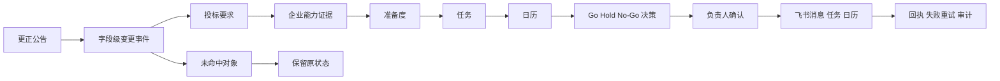

# TenderTrace 提升方向三 变更影响引擎与公告冲击波优化进度与验收报告

**报告日期：** 2026 年 9 月 27 日  
**范围：** 公告版本差异、变更影响分析、行动队列、复核轮次、飞书幂等同步  
**验收对象：** TenderTrace 本地项目 `E:\tt`  
**关联文档：** 《TenderTrace 全国总决赛十二强产品升级方案》提升方向三  
**独立性说明：** 本报告只验收提升方向三。提升方向一、提升方向二的 Markdown 和 PDF 均未修改。  
**当前结论：** 七项实施步骤已全部落入可运行代码。真实政府采购更正公告已形成字段级变更事件、定向影响关系、核心行动队列和独立复核轮次；全量测试、专项测试、接口、数据库、静态资源和项目验收均通过。内置浏览器自动控制因本机组件路径缺失未完成截图级自动点击验收，因此视觉项保留一次人工复核，本报告不会把静态检查写成视觉通过。

## 一 本方向解决的问题

原系统能够保存公告版本并提醒“公告发生变化”，但提醒之后仍需要投标经理人工回答：到底改了什么、影响哪些要求和企业材料、谁负责重新确认、哪些任务和日历要调整、原 Go 决策是否还成立。

本次新增“变更影响引擎与公告冲击波”。系统把更正公告转成字段级事件，沿着业务依赖关系定向传播，并形成可执行、可确认、可同步、可回放的行动清单。

## 二 七项实施步骤逐项验收

| 步骤 | 方案要求 | 实现结果 | 验收证据 | 状态 |
|---:|---|---|---|---|
| 1 | 把版本差异规范成字段事件 | 每条事件保存旧值、新值、变更类型、修订号、来源定位、发现时间、识别方式和置信度 | `change_impact_events`；真实案例生成 3 条字段事件，归入“截止时间”“技术参数”两类 | 通过 |
| 2 | 为要求、匹配、结论、任务和决策保存来源修订关联 | 新增最小影响关系表，每条关系保存 `revision_id`、目标类型、目标编号、原状态、负责人、截止时间和理由 | `change_impact_items`；真实案例保存 24 条事件到对象的可追溯关系 | 通过 |
| 3 | 建立字段到业务对象的影响规则 | 已实现截止时间、金额、资格、技术参数、评分、附件、普通文本七类规则；截止变化传导到任务、日历、准备度和决策，技术变化只命中技术要求及能力证据 | 专项测试验证技术与截止定向命中；资格要求保持不受影响 | 通过 |
| 4 | 非结构化正文只给候选，人工确认后才改变业务状态 | 正文和核心内容识别方式标记为 `rule_candidate`；引擎只生成复核关系与行动，不静默改写要求状态或能力结论 | 真实案例中原要求仍为 `confirmed`，冲击波状态独立保存 | 通过 |
| 5 | 提供四种影响状态 | 已实现“不受影响、建议复核、必须复核、已确认”；确认时保存确认人、说明和时间 | `change_impact_items`、确认接口和审计事件 | 通过 |
| 6 | 多次修订形成独立复核轮次且不重复建任务 | 每个 `revision_id` 唯一对应一个轮次；行动键在同轮次内按业务目标去重，跨轮次使用不同幂等键 | 连续两次修订专项测试形成 R1、R2 两轮，行动编号互不重叠，重复读取不增建行动 | 通过 |
| 7 | 飞书消息、任务和日历保存幂等键、回执与失败重试 | 每项行动分别保存消息、任务、日历状态及外部编号，同时保存幂等键、失败次数、最近错误和最后尝试时间 | 首次故障、再次重试专项测试通过；成功通道不重复创建 | 通过 |

## 三 数据模型与处理规则

### 3.1 新增持久化对象

| 数据表 | 作用 |
|---|---|
| `change_impact_rounds` | 每次公告修订对应一个独立复核轮次，保存严重度、摘要、状态和确认信息 |
| `change_impact_events` | 保存字段级旧值、新值、分类、来源定位、识别方式和置信度 |
| `change_impact_items` | 保存事件到要求、能力匹配、准备度、任务、日历和决策的影响关系 |
| `change_impact_actions` | 保存行动、责任人、截止时间、幂等键及飞书三通道回执 |
| `change_impact_audit_events` | 只追加保存轮次生成、人工确认和飞书同步事件 |

数据库架构版本由 39 升级到 40。现有表、接口和数据未删除，旧数据库执行初始化时会自动创建新表。

### 3.2 结构化变更分类

| 变更类型 | 主要识别字段 | 默认处理 |
|---|---|---|
| 截止时间 | `bid_deadline` | 必须复核；更新倒排任务、日历、准备度和决策 |
| 金额预算 | `budget` | 必须复核报价、评分、投入与决策 |
| 资格条件 | 正文中的资格、资质、证书、信用等词 | 必须复核资格和废标条款 |
| 技术参数 | 正文中的技术、参数、规格、端口、型号等词 | 必须复核对应技术要求、产品证据和匹配结论 |
| 评分办法 | 正文中的评分、分值、得分、评审等词 | 必须复核评分要求和证据 |
| 附件文件 | 附件列表或附件哈希变化 | 建议或必须回看附件证据 |
| 一般文本 | 未命中特定类别的正文变化 | 只给候选，人工确认前不改写业务状态 |

### 3.3 状态与优先级

“不受影响”用于证明系统没有全量重算；“建议复核”用于附件或非确定性候选；“必须复核”用于会改变投标边界或决策的变化；“已确认”表示负责人已经核对来源、前后值和行动。行动优先级与影响状态分离，保证同一变更可以同时保留业务影响和执行紧急度。

## 四 页面与展示设计

公告冲击波嵌入机会详情的“档案时间线”，不增加独立导航负担。页面包含：

1. 冲击波摘要：严重度、复核轮次、修订号、生成时间、受影响对象数和待确认行动数。
2. 状态筛选：必须复核、建议复核、已确认、不受影响和“仅看受影响”。
3. 结构化差异卡：显示分类、识别方式、旧值、新值、来源 URL 和章节定位。
4. 影响路径：按要求、企业证据、准备度、任务、日历、决策六层展示命中节点。
5. 核心行动看板：必须复核、建议处理、已确认三列；每项展示责任人、截止时间和三通道回执。
6. 未受影响证明：明确列出未命中对象及原因，证明系统没有把整个项目全部推倒重算。
7. 版本时间线：每次修订独立显示 R1、R2 等轮次及处理状态。
8. 飞书同步栏：只有确认后的行动才能同步；失败状态保留并允许重试。

视觉组织参考了主流项目协作工具的公开设计逻辑：Linear 的项目时间线与依赖关系强调计划、依赖和状态；Jira 时间线强调任务、日期、依赖和阻塞；Asana 时间线用依赖线呈现冲突。TenderTrace 将这些逻辑收敛到投标更正场景，而没有照搬具体页面。

参考资料：

- Linear Timeline：`https://linear.app/docs/timeline`
- Linear Project Dependencies：`https://linear.app/docs/project-dependencies`
- Linear Project Updates：`https://linear.app/docs/initiative-and-project-updates`
- Jira Timeline：`https://www.atlassian.com/software/jira/guides/basic-roadmaps/overview`
- Asana Timeline Dependencies：`https://help.asana.com/s/article/managing-tasks-and-dependencies-with-timeline`

## 五 真实公开更正公告验收

### 5.1 案例来源

本次使用中国政府采购网真实公开公告“海南省农垦加来高级中学校园监控采购项目（二次）采购更正公告（第一次）”。公告编号为 `[HNBS001]20250500001[GK]-1`，首次公告日期为 2025 年 7 月 24 日，更正日期为 2025 年 8 月 12 日。

官方来源：`https://www.ccgp.gov.cn/cggg/dfgg/gzgg/202508/t20250812_25149498.htm`

### 5.2 真实变更

| 类别 | 原值 | 新值 | 系统动作 |
|---|---|---|---|
| 技术参数 | 视频综合平台原网页文本为“≥6 6口4K HDMI输出板” | 更正为“≥6口4K HDMI输出板” | 复核对应技术要求、企业产品证据和能力匹配 |
| 技术参数 | ≥44口1080P HDMI输入板 | ≥4口1080P HDMI输入板 | 复核对应技术要求、企业产品证据和能力匹配 |
| 截止时间 | 2025-08-14 08:30:00 | 2025-08-28 09:30:00 | 调整倒排任务和日历，重算准备度并重新确认决策 |

公告明确写明“其他内容不变”。系统因此把“供应商基本资格与联合体限制”保留为不受影响，未改写其原 `confirmed` 状态。

### 5.3 现场结果

| 指标 | 结果 |
|---|---:|
| 复核轮次 | 1 |
| 字段级事件 | 3 |
| 结构化类型 | 2 类：截止时间、技术参数 |
| 唯一受影响对象 | 9 |
| 唯一未受影响对象 | 1 |
| 可追溯影响关系 | 24 |
| 去重后的核心行动 | 9 |
| 影响图节点 | 36 |
| 影响图边 | 33 |
| 本地构建与读取耗时 | 28.36 ms |
| 目标耗时 | 不超过 30 秒 |

完整机器可读验收快照保存在 `docs/demo/direction3_change_impact_acceptance_20260927.json`。

## 六 飞书闭环与安全边界

系统为每个行动生成稳定幂等键。消息、任务、日历分别保存 `pending_confirmation`、`sent`、`failed` 或 `not_applicable` 状态，并保存飞书消息编号、任务 GUID、日历事件编号、失败次数、最近错误和最后尝试时间。

负责人点击“确认此行动”之后，页面才开放“同步已确认行动”。同步失败不会删除行动，下一次重试只处理尚未成功的通道。成功的通道会被跳过，避免重复建任务或日历。

本轮验收没有向真实飞书群发送测试消息，避免把验收数据推送给实际成员。专项测试使用确定性的模拟飞书客户端验证了“首次失败、保留错误、再次成功、幂等键不变、成功通道不重复创建”的完整路径。正式页面按钮调用的仍是项目现有飞书客户端和已配置账号。

## 七 接口与普通用户操作

### 7.1 接口

- 查看公告冲击波：`GET /api/opportunities/{notice_id}/change-impact`
- 只看受影响：增加 `affected_only=true`
- 查看指定修订：增加 `revision_id={revision_id}`
- 确认一项行动：`POST /api/opportunities/{notice_id}/change-impact/actions/{action_id}/confirm`
- 同步已确认行动：`POST /api/opportunities/{notice_id}/change-impact/{round_id}/dispatch`

### 7.2 普通用户操作

1. 打开 `http://127.0.0.1:8000/`。
2. 进入“机会台账”，找到“海南省农垦加来高级中学校园监控采购项目（二次）”。
3. 打开机会详情，在“档案时间线”查看“公告冲击波”。
4. 先看结构化差异卡，确认技术参数和截止时间的旧值、新值与官方来源。
5. 查看影响路径，确认技术变化只命中技术要求和产品证据，截止变化命中任务、日历、准备度与决策。
6. 点击“仅看受影响”集中处理；切回“显示全部”查看未受影响证明。
7. 在行动卡中点击“确认此行动”。确认会保存操作者、说明和时间。
8. 至少确认一项后，点击“同步已确认行动”。如通道失败，卡片会显示错误和“可重试”，再次点击即可重试。
9. 在版本时间线查看每次修订的独立轮次和闭环状态。

## 八 自动化与运行验收

| 检查 | 结果 |
|---|---|
| 完整测试套件 | 480 个测试通过 |
| 子测试 | 528 个通过 |
| 失败 | 0 |
| 方向三专项测试 | 3 个通过 |
| 连续修订独立轮次 | 通过 |
| 不受影响对象保持原状态 | 通过 |
| 飞书失败保留与重试 | 通过 |
| 飞书任务幂等键 | 通过 |
| Ruff | 通过 |
| JavaScript 语法 | 通过 |
| 项目验收命令 | 34 项通过，0 警告，0 失败 |
| 首页与静态资源 | HTTP 200 |
| 健康接口 | HTTP 200 |
| 公告冲击波接口 | HTTP 200 |
| 服务重启 | 通过，`127.0.0.1:8000` 正常监听 |

唯一自动化警告来自 FastAPI TestClient 所依赖的 Starlette：httpx 迁移提示，不影响当前功能和接口结果。

## 九 回归与风险复核

### 9.1 对既有功能的影响

本次新增五张独立数据表、三个接口、一套真实案例准备脚本和机会详情中的冲击波区域。公告版本表、要求账本、能力匹配、机会工作流和原飞书接口均未删除或改名。全量测试覆盖检索、采集、飞书、机会管理、要求账本、能力匹配、会审、数字孪生、证据显微镜、报告与交付审计，未发现自动化可检测的功能损失。

### 9.2 已处理的重复风险

正文与核心摘要可能同时识别到同一类技术变化。系统保留两条字段事件和各自来源关系，但行动键按“轮次 + 业务目标”去重。因此可以追溯两个字段的变化，同时只创建一项对应业务行动，避免同轮次重复建飞书任务。

### 9.3 已处理的误伤风险

影响引擎不修改原要求状态，只写独立影响状态。只有规则明确命中的技术、截止、金额、资格、评分或附件对象进入复核。一般正文候选保持“建议复核”，人工确认前不会让原业务结论失效。真实案例中的资格要求保持原状态，证明没有全量重算。

### 9.4 当前限制

内置浏览器控制组件启动时返回本机运行组件路径缺失，无法完成自动截图、真实点击和窄屏视觉回归。HTTP 页面、CSS、JavaScript 语法、DOM 字符串、接口交互和静态资源均已通过。比赛前仍应在当前页面刷新后人工确认一次桌面、窄屏和深色模式，重点看长差异文本换行、六层影响路径、三列行动看板与按钮反馈。

## 十 后续可继续提升的方向

1. 对长篇更正正文引入段落级语义差异，减少同一技术变化在正文与摘要中的重复关系。
2. 对附件内表格增加单元格坐标，把“第几页、第几表、第几行、第几列”直接带入来源定位。
3. 增加影响规则编辑台，允许比赛现场展示“字段改变后为什么命中这些对象”。
4. 对倒排计划加入关键路径计算，显示截止提前后最早受阻的任务和剩余缓冲。
5. 对金额变化自动调用报价模型，形成收入、毛利、资源投入和机会优先级的联动结果。
6. 对评分办法变化重新计算可得分项，并展示总分变化前后对比。
7. 对资格变化加入“一票否决”标记，优先推送法务与合规负责人。
8. 增加复核轮次对比，查看 R1 到 R2 哪些行动新增、消失或继续有效。
9. 将飞书卡片回链到指定修订与行动，点击后直接定位到对应冲击波卡片。
10. 浏览器控制组件恢复后建立桌面、移动端、深色模式三组视觉回归基线。

## 十一 最终验收结论

提升方向三已经完成从公告版本差异、字段级事件、定向影响传播、状态分级、核心行动、负责人确认、独立复核轮次到飞书幂等同步与失败重试的完整闭环。真实公开更正公告证明系统能够同时处理技术参数和截止时间两类变化，并明确证明未受影响的资格要求不会被误伤。

工程功能可判定为验收通过。页面设计已经进入本地运行版本，接口和静态资源均可用；截图级视觉自动化受本机浏览器控制组件限制，比赛前保留一次人工视觉复核。该限制已如实记录，不影响当前数据、接口、服务和自动化回归结论。
