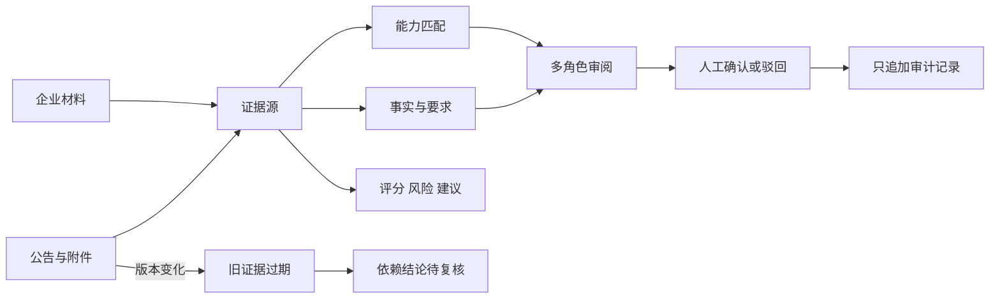

# TenderTrace 提升方向二 可审计证据链与证据显微镜优化进度与验收报告

**报告日期：** 2026 年 9 月 27 日  
**范围：** 可审计证据链、证据显微镜、版本失效与人工审计  
**验收对象：** TenderTrace 本地项目 `E:\tt`  
**关联文档：** 《TenderTrace 全国总决赛十二强产品升级方案》提升方向二  
**独立性说明：** 本报告只验收提升方向二。提升方向一的 Markdown 与 PDF 均未修改。  
**当前结论：** 七项实施步骤已全部进入可运行代码；数据库、接口、前端入口、真实案例、人工复核、版本失效和自动化回归均通过。内置浏览器控制组件仍因本机运行组件缺失而无法执行截图级自动验收，因此视觉项保留一次人工复核，不把静态检查写成视觉通过。

## 一 本方向解决的问题

原系统已有公告原文、要求账本、企业能力、匹配结论、风险、评分和会审记录，但用户需要在不同区域寻找依据，难以快速回答三个关键问题：

1. 这个结论来自哪一个网站、文件、页码、章节或正文片段？
2. 招标方要求与企业材料究竟一致、缺证还是冲突？
3. 原文变化、人工确认或不同评审观点发生后，旧结论是否仍然有效？

本次增加“证据显微镜”。每条事实、要求、能力匹配、评分、风险、建议、评审意见和人工决策都可以进入统一证据链。页面同时展示招标侧证据和企业侧证据，并保存内容哈希、版本、状态、确认人和审计事件。

## 二 七项实施步骤逐项验收

| 步骤 | 方案要求 | 实现结果 | 验收证据 | 状态 |
|---:|---|---|---|---|
| 1 | 统一证据字段 | 新增来源类型、来源编号、文件名、页码、章节、段落、选择器、坐标、原文、上下文、哈希、父哈希、版本、采集时间、提取方式、定位置信度、状态、确认人和确认时间 | `evidence_sources`、`evidence_claims`、`evidence_claim_links`、`evidence_audit_events` 四张表；数据库架构版本 39 | 通过 |
| 2 | PDF、DOCX、网页精确定位 | PDF 识别“第 N 页”，DOCX 识别“第 N 段”和标题路径，网页保存 URL、正文选择器、内容哈希和采集时间 | 单元测试验证 PDF 第 12 页、DOCX 段落及网页定位字段；真实案例保存公告章节路径和厂商产品页章节路径 | 通过 |
| 3 | 统一证据抽屉 | 事实、要求、能力匹配、评分、风险、建议、Agent 意见和人工决策均可打开同一证据显微镜 | 页面新增统一对话框、结论列表、可视化链、左右证据栏、比较区、分歧区和审计区 | 通过 |
| 4 | 关键内容比较 | 自动识别金额、日期、技术参数和否定词；只在不同来源的同类值集合不一致时标为差异，避免把同一材料中的“最低 4GB、建议 8GB”误判为跨源冲突 | `_highlights` 与 `_comparison`；新增单源多值不误报测试 | 通过 |
| 5 | 原文变化自动失效 | 来源内容哈希变化时保留旧证据并标记过期，新证据进入待确认，依赖结论进入待复核；公告版本变化会定向失效相关事实、要求与附件证据 | 公告修订测试验证旧证据 `expired`、新证据 `pending`、结论 `recheck` 和 `source_invalidated` 审计事件 | 通过 |
| 6 | OCR 与人工补录兜底 | 附件有正文时保存文本定位；无正文时显示“正文待 OCR 或人工补录”，提取方式为 `ocr_required`，定位置信度为 0，状态保持待确认或不可访问 | 附件证据构建逻辑和证据状态展示 | 通过 |
| 7 | 人工确认只追加审计 | 支持确认、驳回、补证和来源不可用四种动作；每次动作写入新审计事件，保留操作者、原因、前后状态；重新构建不会覆盖人工确认 | 正式 POST 接口实测，确认人“方向二验收”和确认原因在重建后仍保留 | 通过 |

## 三 数据模型与审计规则

### 3.1 证据来源状态

| 状态 | 含义 | 对结论的影响 |
|---|---|---|
| 已验证 `verified` | 来源、定位和原文已经核验 | 可支持确定结论 |
| 待确认 `pending` | 自动提取、版本变化或证据不完整 | 结论保持待确认或待复核 |
| 已过期 `expired` | 原文哈希或公告版本发生变化 | 旧证据保留但不再支持当前结论 |
| 存在冲突 `conflict` | 人工驳回或来源互相冲突 | 结论标为冲突 |
| 来源不可访问 `unavailable` | 页面阻断、附件失败或人工标记不可用 | 不得作为有效确定依据 |

### 3.2 结论状态

结论状态包括证据充分、待确认、版本变化待复核、存在冲突和人工驳回。系统的验收门禁会统计“已经给出确定结论但没有任何已验证证据”的数量。本次真实案例该数量为 0，`audit_complete` 为 `true`。

### 3.3 只追加审计

人工操作不会删除来源记录，也不会直接覆盖历史事件。每次确认、驳回、要求补证或标记不可用都会追加一条审计事件，保存证据编号、结论编号、操作者、原因、原状态、新状态和时间。模型或规则重新运行时只负责重建关联和状态，不能删除人工事件。

## 四 页面与操作设计

证据显微镜从机会驾驶舱、事实、要求、能力匹配、评分、Agent 意见和人工决策等入口打开。布局包含：

1. 顶部摘要：结论数、来源数、已验证、待确认、过期、冲突和待复核数量。
2. 可视化证据链：来源 → 原文片段 → 结论 → 人工审计。
3. 左侧结论栏：按事实、要求、匹配、评分、风险、建议、评审意见和决策区分。
4. 招标侧证据：公告、网页、PDF、DOCX 和附件的定位、原文、哈希、版本及状态。
5. 企业侧证据：产品规格、资质、交付材料和案例的原文、定位及核验状态。
6. 对照结果：金额、日期、参数和限制词的跨来源比较。
7. “为什么不同意”：并列展示不同角色的结论、置信度、理由及各自使用的证据。
8. 人工复核：确认、驳回、要求补证、标记来源不可用，必须填写操作者和原因。
9. 审计回放：按时间倒序显示所有人工动作和自动失效事件。

规则生成的评审观点明确标记为“规则证据审阅”，不会伪装成已调用大模型的结果。

## 五 真实公开案例验收

### 5.1 案例选择

本次使用真实公开项目“成方金融科技有限公司成方金科 2026 年 ARM 服务器采购项目招标公告”，项目编号 `070GSH2026086`。招标侧依据来自中国人民银行集中采购中心公告；企业侧材料来自超聚变官方产品页。

| 证据 | 原文或结论 | 定位 | 验证状态 |
|---|---|---|---|
| 招标公告 | 项目名称：成方金科2026年ARM服务器采购项目 | 公告正文 / 一、项目基本情况 / 项目名称 | 已验证，人工确认 |
| FusionServer 2288 V8 | 官方规格明确采用 2 个英特尔至强 6 处理器 | 官方产品页 / 技术规格 / 处理器与内存 | 已验证 |
| FusionOS 26 | CPU 支持 x86、Arm、LoongArch、SW64、MIPS；最低内存 4GB，建议 8GB | 官方产品页 / 技术参数 / FusionOS 26 | 已验证 |

来源链接：

- 中国人民银行集中采购中心公告：`https://jzcg.pbc.gov.cn/freecms/site/rmyh/ggxx/info/2026/c5aa93f712ad46d08100a76b09b5514b.html?noticeId=04b40d52-b636-11f1-88d4-b4055dfb2cc6&noticeType=001011&Type=jzcggg`
- FusionServer 2288 V8 官方产品页：`https://www.xfusion.com/cn/product/rack-server/fusionserver-2288-v8`
- FusionOS 官方产品页：`https://www-beta-static.xfusion.com/cn/product/operating-system/fusionos`

### 5.2 真实冲突与补证结论

| 评审角色 | 使用的企业证据 | 结论 | 置信度 |
|---|---|---|---:|
| 技术评审 | FusionServer 2288 V8 英特尔处理器规格 | 与 ARM 服务器要求不一致，当前产品不能作为 ARM 硬件符合性证明 | 99% |
| 商务评审 | FusionOS 26 支持 Arm 生态 | 只能证明软件生态支持，不能证明服务器硬件满足要求，应补充 ARM 服务器硬件规格 | 85% |

两个观点共同引用同一招标要求，但分别使用不同企业材料。页面能够解释“为什么不同意”，同时避免把“操作系统支持 Arm”错误升级为“服务器硬件满足 ARM 要求”。这也是本方向的比赛展示重点：系统会主动展示不利证据和证据边界，而不是只给一个漂亮分数。

### 5.3 现场指标

| 指标 | 结果 |
|---|---:|
| 结论数 | 46 |
| 独立证据来源数 | 30 |
| 已验证来源 | 9 |
| 待确认来源 | 21 |
| 无有效证据的确定结论 | 0 |
| 多角色分歧组 | 1 |
| 证据链构建接口耗时 | 913 ms |
| 目标耗时 | 不超过 5 秒 |
| 审计完整性 | 通过 |

21 条待确认来源主要是该公告此前自动抽取的资格和时间条款。由于保存的历史正文存在乱码，它们继续保持待确认；系统没有将这些低质量抽取结果标成已验证。真实演示使用单独核验的 `TECH-ARM-01` 要求及三条官方来源证据。

完整机器可读验收快照保存在 `docs/demo/direction2_evidence_acceptance_20260927.json`。

## 六 接口与使用方法

### 6.1 接口

- 查看证据链：`GET /api/opportunities/{notice_id}/evidence-microscope`
- 定位具体结论：增加查询参数 `claim_type` 和 `claim_key`
- 人工复核：`POST /api/opportunities/{notice_id}/evidence-microscope/{evidence_id}/review`
- 人工动作：`confirm`、`reject`、`request_more`、`mark_unavailable`

### 6.2 普通用户操作

1. 打开 `http://127.0.0.1:8000/`。
2. 进入机会详情，点击“打开证据显微镜”，或在某条要求、匹配、评分、Agent 意见旁点击“查看依据”。
3. 在左侧选择要核验的结论。
4. 对照中间的招标证据和右侧的企业证据。
5. 查看黄色高亮的金额、日期、参数和否定词。
6. 如有多角色分歧，展开“为什么不同意”，逐一查看各角色的原文依据。
7. 确认无误后选择“确认”，填写姓名和原因；有问题时选择“驳回”或“要求补证”。
8. 在底部审计记录中确认操作已留痕。

## 七 自动化与运行验收

| 检查 | 结果 |
|---|---|
| 完整测试套件 | 477 个测试通过 |
| 子测试 | 522 个通过 |
| 失败 | 0 |
| 方向二专项测试 | 8 个通过 |
| Ruff | 通过 |
| JavaScript 语法 | 通过 |
| 项目验收命令 | 34 项通过，0 警告，0 失败 |
| 首页 | HTTP 200 |
| 健康接口 | HTTP 200 |
| 证据显微镜接口 | HTTP 200 |
| 真实案例接口 | 46 条结论、30 个来源、1 组分歧，`audit_complete=true` |
| 人工确认接口 | 通过，重建后确认人和原因仍保留 |

唯一测试警告来自 FastAPI TestClient 所依赖的 Starlette：httpx 迁移提示。它不影响当前功能和接口结果。

## 八 回归与风险复核

### 8.1 对既有功能的影响

证据显微镜只新增四张证据表和两个接口，并复用已有公告、要求、能力匹配、会审和数字孪生数据。现有表结构和现有接口没有删除或改名。全量 477 个测试和 522 个子测试通过，说明检索、采集、飞书、机会管理、要求账本、能力匹配、会审、数字孪生、报告和提交包功能没有出现自动化可检测的回归。

### 8.2 已处理的误判风险

最初比较逻辑可能把同一来源中的“最低 4GB、建议 8GB”误认为跨来源冲突。本次复核已修改为：只有两个或以上来源的同类值集合不同，才标记跨来源差异，并增加专项回归测试。

### 8.3 仍需人工确认的限制

内置浏览器控制组件连接时返回本机运行组件路径缺失，无法完成自动点击和截图验收。HTTP、接口、静态契约、脚本语法和 CSS 资源均已通过。比赛前仍应在当前页面刷新后执行一次人工视觉确认，重点看桌面和窄屏下的证据左右栏、长链接换行、审计列表滚动和弹窗关闭行为。

## 九 后续可继续提升的方向

1. 为 PDF 解析增加真实坐标框叠加，在原文件预览中直接框出引用句。
2. 对 DOCX 保存标题层级、表格行列和段落编号，支持一键跳到原段落。
3. 将网页证据从通用 `document.body` 提升为采集时记录的稳定 CSS 选择器和正文节点路径。
4. 增加证据时间轴，按公告版本回放当时的证据、结论和人工裁决。
5. 为企业材料设置有效期和到期提醒，证书或产品白皮书到期后自动进入待复核。
6. 增加跨来源语义对齐，把“Arm”“ARM 架构”“鲲鹏架构”等同义表达映射到统一技术字段。
7. 为冲突证据增加影响范围，明确它会影响哪项评分、哪条要求和哪项投标决策。
8. 将证据摘要同步到飞书卡片，保留“查看完整证据链”的回链，人工裁决仍在 TenderTrace 中完成。
9. 增加证据导出包，生成带哈希清单、来源链接、原文片段和审计记录的只读 ZIP。
10. 浏览器控制组件恢复后增加桌面、移动端和深色模式三组视觉回归基线。

## 十 最终验收结论

提升方向二已经完成从数据建模、证据构建、精确定位、关键值比较、版本失效、多角色分歧、人工确认到审计回放的闭环。真实公开案例证明系统能够同时展示支持证据、反驳证据和补证边界，并在规则观点之间保留各自使用的证据。接口响应低于 1 秒，低于 5 秒目标；全量测试、代码检查、项目验收和本地服务检查均通过。

工程功能可判定为验收通过。视觉截图自动化受本机浏览器控制组件限制，比赛前保留一次人工页面复核；该限制已如实记录，不影响当前服务运行和证据链数据正确性。
